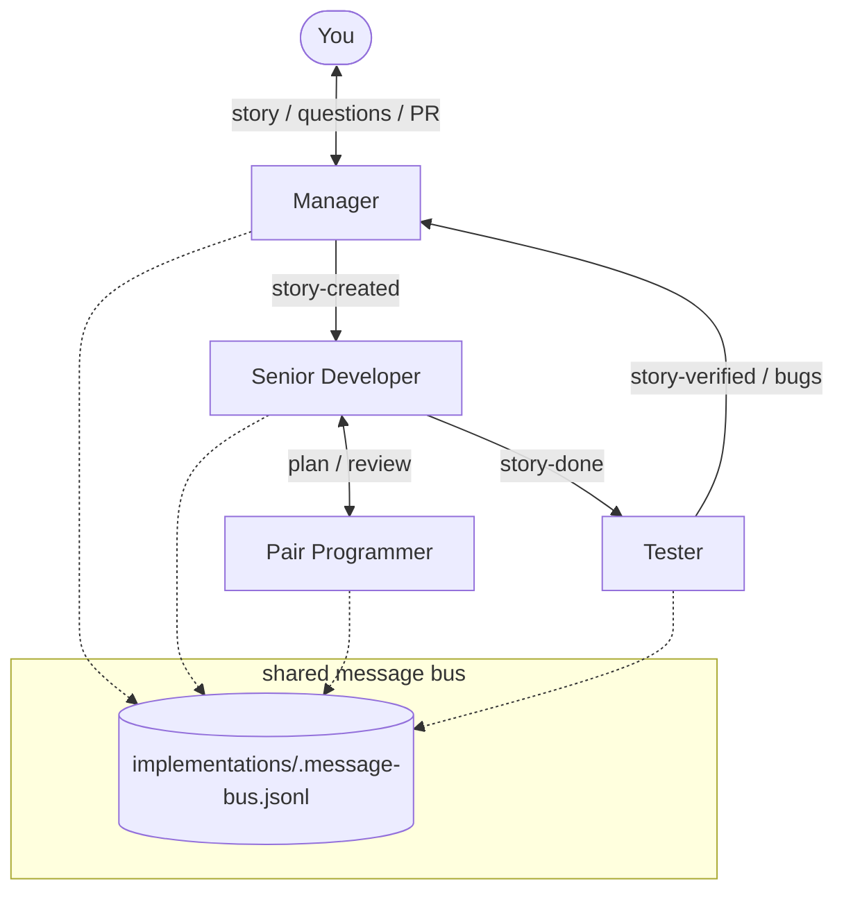
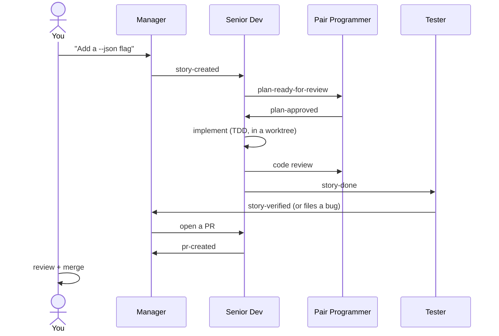
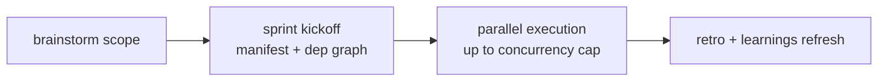
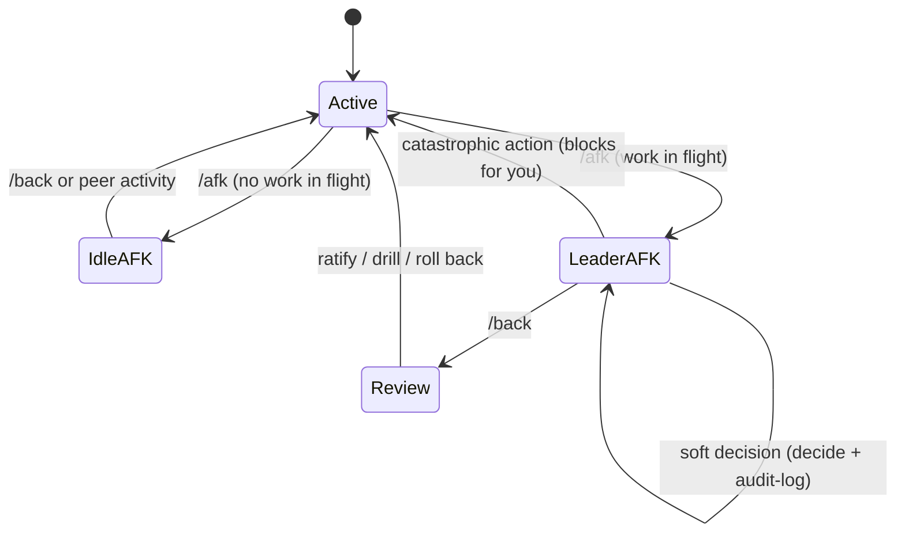

# claude-wow

A five-role team for Claude Code. One agent talks to you; the rest plan, build,
review, and test the work between themselves over a shared message bus.

You write a one-line request. The **Manager** turns it into a story. A **Senior
Developer** writes a plan, gets it reviewed by a **Pair Programmer**, implements
it, and a **Tester** verifies it in a real worktree. You get a pull request back.

### What you get

- One conversation to drive (the Manager). You never juggle five chat windows.
- Every change gets a written plan, a code review, and a test pass before it
  reaches a PR.
- It keeps working while you step away (`/afk`), pauses itself when you hit a
  usage limit, and reports PR/CI status from GitHub onto its own bus.

## Quick start

You need the `claude-plugins-official` marketplace registered (Anthropic's
default). Then add this marketplace and install:

```
/plugin marketplace add nedati-technologies/claude-wow-plugin@dist
/plugin install claude-wow
```

If the short URL fails to resolve, use the long form:

```
/plugin marketplace add git+ssh://git@github.com/nedati-technologies/claude-wow-plugin.git@dist
```

Claude Code auto-installs the six plugin dependencies. Now open one terminal per
role and start them — Manager first:

```
/claude-wow:manager
```

Then, each in its own terminal: `/claude-wow:senior-developer`,
`/claude-wow:pair-programmer`, `/claude-wow:tester` (and `/claude-wow:slacker`
if you use Slack). Each runs its own startup, claims its role, and arms a bus
monitor.

Give the Manager your first story in plain language:

```
Add a --json flag to the export command.
```

The Manager writes the story; the team takes it from there. You answer the
occasional question and review the PR. To upgrade later, run `/plugin update
claude-wow` per project (plugins don't auto-update).

## The five roles

| Role | Does | Talks to you? |
|------|------|---------------|
| **Manager (M)** | Writes stories, orchestrates, owns priorities | Yes — the only one |
| **Senior Developer (SD)** | Writes plans, implements the code | No |
| **Pair Programmer (PP)** | Reviews plans, code, and bug fixes | No |
| **Tester (T)** | Tests finished work in a worktree, files bugs | No |
| **Slacker (S)** *(optional)* | Runs Slack comms, escalates to M | No |

The roles never call each other directly. They coordinate through one
append-only file — the **message bus** (`implementations/.message-bus.jsonl`).
Each message carries a `to` field (an exact agent, a role like
`senior-developer-*`, or `*` for everyone). The Manager orchestrates but does
not relay messages; peers address each other. Each role's monitor pre-filters
the bus so it only wakes for messages addressed to it.



## The development lifecycle

One story walks the whole loop. This is the spine of how claude-wow works.



1. **Story.** M writes `implementations/stories/<id>-<slug>.md` and dispatches it.
2. **Plan.** SD writes a plan; PP reviews it on the bus until approved.
3. **Implement.** SD codes in a per-story git worktree, test-first.
4. **Review + test.** PP reviews the code; T verifies it against the acceptance
   criteria and files bugs if it breaks.
5. **PR.** After T verifies, M asks SD to open the pull request.
6. **Merge.** You review and merge. Nothing merges without you.

## Sprint mode

For a batch of related work, run a sprint. You brainstorm the scope with M once;
M writes a manifest of stories with a dependency graph, then drives them
autonomously — dispatching independent stories in parallel up to a concurrency
cap, and gating dependent ones until their parents land. At the end the team
runs a retro and records learnings.



## Advanced capabilities

### AFK mode — keep working while you step away

`/afk` tells the Manager you are gone; `/back` returns. What M does depends on
whether work is in flight:

- **Nothing in flight** → *idle-AFK*: M stops its periodic cron and waits. Any
  peer activity or `/back` wakes it.
- **Work in flight** → *leader-AFK*: M keeps driving. It makes the soft
  decisions you would normally be asked (the `AskUserQuestion`-class ones)
  autonomously and writes each to an audit log. **Catastrophic or irreversible
  actions still stop and wait for you** — that boundary never moves.

On `/back`, M shows you every autonomous decision and lets you ratify, drill in,
or roll back.



### Usage-limit auto-pause + statusline

Opt in and the team pauses itself before it burns through your 5-hour or 7-day
usage window, then resumes when the window resets. M asks once whether to enable
it.

The data comes from your statusline. claude-wow installs a snapshot statusline
script in your **config dir** (`${CLAUDE_CONFIG_DIR:-$HOME/.claude}`) that
records the `rate_limits` fields and **passes your existing statusline through
unchanged**. It never writes your project's `.claude`, and it never blanks your
statusline — if you had none, you still have none.

```
┌─ my-project · main ───────────────────────── claude-opus-4-8 ─┐
│ ctx 42%  ·  5h ########.. 78%  ·  7d ###....... 31%           │
└───────────────────────────────────────────────────────────────┘
```

### GitHub bridge

The bridge polls `gh` and drops PR, CI-check, and review events onto the bus as
they happen. M sees `pr-state: merged`, a failing check, or a new review comment
without you forwarding anything. Needs an authenticated `gh`.

### Slack integration (optional)

Add the **Slacker** role and the team reads and posts in a Slack channel.
Slacker handles the chat and escalates technical or project questions to M. The
Slack bridge is **bundled** in the plugin (`bridge/slack/`); Slacker auto-launches
it on startup — no separate process to run. Needs `node` and your Slack creds.

### Memory / learnings

Each role keeps a learnings file (`implementations/learnings/<role>.md`). At
each sprint retro the team refreshes them — folding in what it learned and
pruning stale notes — so the next sprint starts smarter.

### Multi-team

Run more than one team against one project as **separate clones** that share only
the GitHub remote. Each clone has its own bus, agents, and worktrees; the
shared-remote artifacts carry a team label (set from `implementations/.my-team`):
team-scoped branches (`feat/<team>/<NNN>-slug`), a `[<team>]` PR title prefix, and
a `WOW-Team:` commit trailer — so teams coexist on the repo like separate humans.

## Requirements

| Tool | For |
|------|-----|
| `bash`, `jq` 1.6+, `grep`, `sed` | core runtime + bundled tests |
| `python3` (stdlib only) | MCP server + GitHub bridge |
| `gh` (authenticated) | GitHub bridge only |
| `node` 20+ | Slack bridge only |
| Playwright MCP | Tester's browser-driven tests (bundled via the `playwright` dependency) |

No `pip install` or `npm install` at the consumer. The six dependencies
(`superpowers`, `playwright`, `code-review`, `security-guidance`,
`claude-md-management`, `frontend-design`) install automatically from
`claude-plugins-official`. They track latest (no version pins); the maintainer
checks for drift with `bash scripts/check-plugin-updates.sh --deps`.

## Configuration and where state lives

- **Per project:** `implementations/` — stories, plans, backlog, sprints,
  learnings, and the message bus (`implementations/.message-bus.jsonl`). This is
  the team's shared memory for that repo.
- **Per machine:** `$HOME/.wow-<user>/` — credentials and machine-local state,
  kept out of the project.
- **Your project facts:** put app names, ports, build/lint commands, and
  framework conventions in your project's own `AGENTS.md` (or `CLAUDE.md`). The
  roles read it at startup. The plugin itself stays project-agnostic.

## Troubleshooting

- **"My statusline disappeared."** An older build could install into the wrong
  settings file. Re-run the opt-in; the current install resolves your config-dir
  settings itself and repairs a prior bad install.
- **"A peer never came online."** Check that its terminal ran its startup
  (`/claude-wow:senior-developer`, etc.) and claimed its role. Each role needs
  its own terminal.
- **"An MCP tool failed."** The team routes around a dead MCP server and asks you
  to restart it in plain text — follow that prompt, then continue.

## Links

- Source repo: <https://github.com/nedati-technologies/claude-wow-plugin>
- Contributing and internals: `AGENTS.md` (in this repo).
- Multi-agent protocol: `commands/_agent-protocol.md` (bundled).
- Upgrade history: `docs/superpowers/migrations/`.
